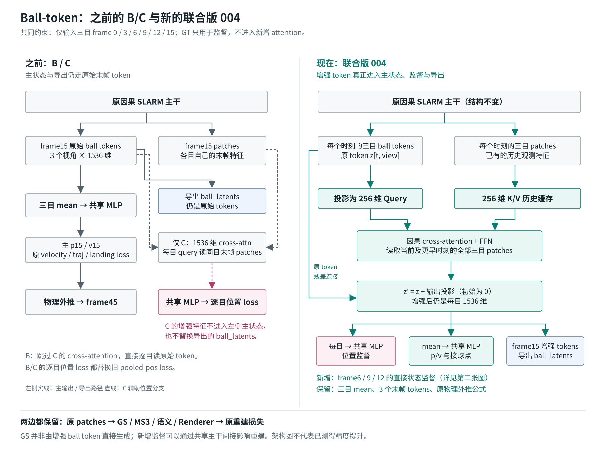
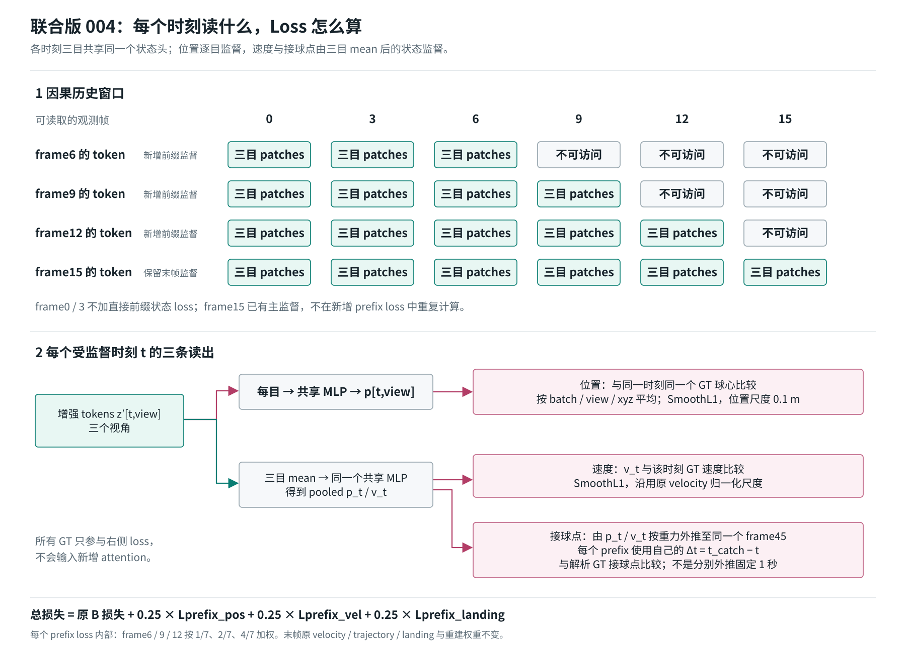

# Ball-token 改动前后对照

对应当前实现和 `exp0910_004_balltoken_temporal_joint.yml`。图中的绿色表示新增读取或增强路径，粉色表示监督，蓝色表示 latent 导出。精度收益尚待训练验证。

## 1. 主流程：之前 B/C 与现在 004



最重要的区别：**C 的 cross-attention 只服务辅助位置监督；004 增强后的 tokens 同时进入主 p/v 预测和 `ball_latents` 导出。**

原主干本来就有因果历史和跨视角交互。004 不是第一次引入历史信息，而是增加一层显式的、由球 token 查询历史 patches 的读取模块。

| 版本 | 主 p/v 读出 | 逐目位置监督读取什么 | 导出 latent | 新增直接前缀监督 |
| --- | --- | --- | --- | --- |
| 原始 / 001 control | 原三目 tokens 的 mean → MLP | 无逐目监督，使用 pooled 位置监督 | 原末帧 tokens | 无 |
| 002 B | 原三目 tokens 的 mean → MLP | 原末帧每目 token | 原末帧 tokens | 无 |
| 003 C | 原三目 tokens 的 mean → MLP | 每目 token 经同目末帧 patch cross 增强 | 原末帧 tokens | 无 |
| **004 joint** | **增强三目 tokens 的 mean → MLP** | **读取当前及历史全部三目 patches 后的 token** | **增强末帧 tokens** | **frame6/9/12 的位置、速度、接球点** |
| 005 prefix-only | 原三目 tokens 的 mean → MLP | 原 token | 原末帧 tokens | 同 004，但没有新增历史读取模块 |

B/C/004/005 的逐目位置监督都替换原 pooled-position loss，不是把两种位置 loss 重复相加。各时刻、各视角和 pooled 分支共享同一个 MLP；`MLP(mean(tokens))` 不是 `mean(MLP(tokens))`。

## 2. 因果范围与 Loss



三个视角预测的是同一个 rig 坐标系中的球心。因此同一时刻三个 token 的位置监督目标相同；frame6、9、12 各自使用对应时刻的 GT，而不是都使用 frame15 的球心。

令增强 token 为 `z'[t, view]`，共享状态头为 `h`：

```text
逐目位置：p[t, view] = h(z'[t, view])[:3]
融合状态：(p_t, v_t) = h(mean_view(z'[t, view]))
接球位置：p_catch(t) = p_t + v_t * dt_t + 0.5 * g * dt_t^2
时间间隔：dt_t = catch_dt_from_frame15 + timestamp15 - timestamp_t
```

每个前缀都外推到同一个绝对 frame45，而非各自再推固定一秒。当前配置的 frame45 是解析弹道参考点，不是与地面相交的落地事件，也不代表实际机器人接球成功。

```text
L_joint = L_existing_B
        + 0.25 * L_prefix_pos
        + 0.25 * L_prefix_vel
        + 0.25 * L_prefix_landing

L_prefix_* = (L_frame6_* + 2 * L_frame9_* + 4 * L_frame12_*) / 7
```

- 原 B 已有从末帧主状态得到的 trajectory / landing 约束。新增 prefix loss 的区别是直接约束早期 token 自己读出的状态，不只是再次外推 frame15 的状态。
- frame15 沿用原末帧监督，不重复加入新 prefix loss；frame0/3 不加新的直接状态 loss。
- 位置和接球点使用 0.1 m 归一化的 SmoothL1；速度沿用原归一化尺度。GT 只参与 loss，不输入新增 attention。

## 3. 明确保留的部分

- 输入仍是三目 frame0/3/6/9/12/15，没有加入 frame15 之后的晚观测。
- 每个时刻仍是三个球 token；导出仍为 `[B, 3, 1536]`，没有扩充 token 数量。
- 主 p/v 仍采用三目特征 mean。004 的新增 cross-attention 也会读取多目 patches，所以不是取消三目融合的方案。
- 原 patches → GS / MS3 / semantic / renderer 的结构与重建损失权重不变。新增监督会通过共享主干间接影响重建，但 GS 不是由增强 ball tokens 直接生成。
- 只增加 latent 导出的一致性，尚未接入 DynamicVLA，也未证明 latent 的下游效用提高。

004 的新增模块约 191 万参数，256 维、4 heads，带时间和视角编码。输出投影零初始化，加载旧权重后的起点保持原 token 读出。详细参数、运行命令及验证范围见 [联合微调说明](BALL_TEMPORAL_JOINT_FINETUNE.md)。

## 4. 代码对应

- [历史 patch 读取及残差增强](../src/models/ball_temporal.py)：`BallTemporalRefiner`。
- [共享状态头、增强 latent 导出](../src/models/slarm.py)：`_forward_ball_temporal_states`。
- [前缀损失与权重](../src/utils/stream25_losses.py)：`ball_prefix_losses`。
- [流式历史缓存](../src/models/stream_session.py)：`StreamSession`。

SVG 为可缩放原图，可直接用于汇报；另有 [主流程 PNG](figures/ball_temporal_before_after.png) 和 [Loss PNG](figures/ball_temporal_losses.png)。当前文档描述结构差异，不把尚未运行的实验写成精度结论。
