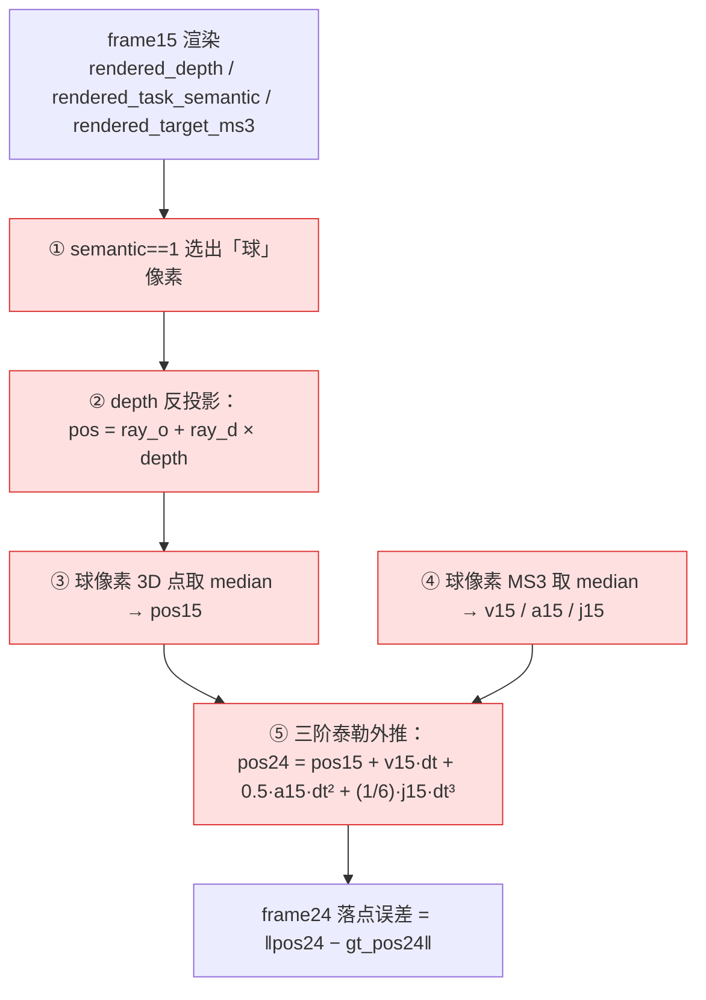
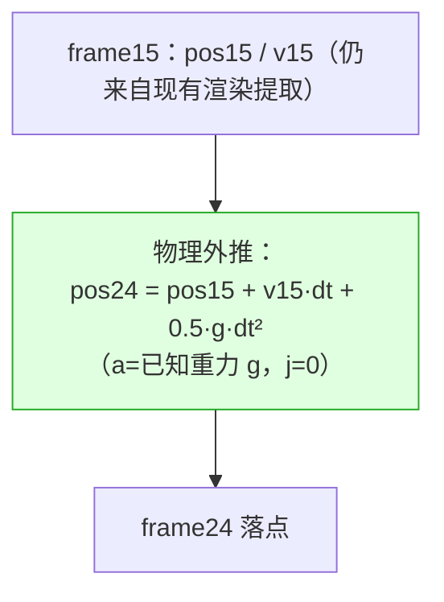
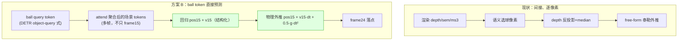

# 球轨迹 / 落点预测：现状分析与改进方案

> 目标：室内接球，最终只需 **frame24（接球面）的球 3D 落点**，越准越好。
> 本文对比「当前落点计算流程」与两个改进方案（物理外推 / ball token），并附一个
> **无需重训**的验证脚本 `tools/verify_physics_extrapolation.py`。

---

## 1. 当前落点是怎么算的（`compute_rendered_frame24_position_errors`）

模型并不直接输出球的落点，而是**从 dense 渲染结果里间接反算**：



**每个红框都是脆弱点**：语义分错→选错球像素；depth 不准→3D 位置偏；球像素少→median 抖；
而最致命的是第 ⑤ 步。

### 为什么 farthest 段必崩（数学根因）

第 ⑤ 步用的是网络 **free-form 预测**的 `a15 / j15`，它们的误差被 `dt² / dt³` 放大：

| 项 | 误差放大 |
| --- | --- |
| v15 误差 | × dt（一阶，小） |
| **a15 误差** | **× 0.5·dt²（二阶放大）** |
| **j15 误差** | **× (1/6)·dt³（三阶放大）** |

实验数据 `ms3_ball_acceleration p95 = 8.5`，乘上 `0.5·dt²` 就是巨大的位置偏移。
**不是模型不懂物理，而是 free-form 高阶噪声被 dt²/dt³ 数学放大** —— 外推越远炸得越狠，
与观测到的 `frame24_position p95` / `ball_depth farthest p95` 崩盘完全吻合。

---

## 2. 方案 A：物理外推（最快见效，可先验证再决定）

球在 frame15 之后是**自由落体 + 初速度**：真实 `a ≡ 重力 g`，`j ≡ 0`。
把第 ⑤ 步的 a/j 从「网络预测」换成「已知物理」：



- **只依赖 pos15 + v15（一阶）**，彻底消除被 dt²/dt³ 放大的 a/j 噪声源。
- config 里 `ms3_acceleration_scale: 9.81` 和「球区域监督重力+零 jerk」本就假设了这个物理，
  这里只是把它**硬编码进外推**，不再靠网络预测。

### 先验证（不用重训）

用 `tools/verify_physics_extrapolation.py`，拿**正在跑的任意 ckpt**，对验证集重算 frame24：

```bash
SLARM_SINGLE_PROCESS=1 python tools/verify_physics_extrapolation.py \
    --config <config.yaml> --checkpoint <ckpt.pth> \
    --split validation --limit 100 --gravity 0,0,-9.81
```

它对同一批提取出的 `pos15/v15/a15/j15`，对比三种外推的 median/p95：

| 策略 | 外推公式 |
| --- | --- |
| `free`（现状） | `pos + v·dt + 0.5a·dt² + (1/6)j·dt³` |
| `phys`（物理） | `pos + v·dt + 0.5·g·dt²` |
| `linear` | `pos + v·dt` |

**若 `phys` 的 p95 明显低于 `free`**，就证明「a/j free-form 是元凶」，物理外推值得正式做。

### 进一步：拆解误差来源（`--ball-mask-source`）

当前 eval 的球区域是用**预测语义**（`rendered_task_semantic==1`）选的，**不是 GT**。所以 frame24
崩盘可能来自三环：① 语义选错球像素、② depth 反投影不准、③ 外推公式。脚本用
`--ball-mask-source pred|gt|both`（默认 `both`）把「球区域来源」也纳入对比，做 2×3 拆解：

| 球区域 | 外推 | 隔离出什么 |
| --- | --- | --- |
| pred | free | 现状 |
| pred | phys | 去掉③ → 物理外推能救多少 |
| **gt** | free | 去掉① → 若比 pred×free 好很多 = **语义选球是瓶颈** |
| gt | phys | 上界（只剩 ② depth 反投影误差） |

一次跑就能定位是「语义 / depth / 外推」哪一环拖后腿：外推环 → 物理外推最值；
语义环 → ball token 直接回归球位置最值。

> 坐标系提醒：pos/v/a/j 都已 transform 到 **rig 系**，gt_pos24 也是 rig 系，所以 `--gravity`
> 要给 rig 系下的重力向量。脚本会打印「GT 球加速度(rig) 均值」帮你核对方向/量级
> （它应当 ≈ 你要填的 g）。

---

## 3. 方案 B：ball token（结构升级，顺带解决不可见帧）

物理外推修好了「外推公式」，但前半段「语义选像素 + depth 反投影 + median」依然脆。
**ball token** 用一个专门的 query 直接预测球状态，替换这条前半段：



- **直接监督你真正要的量**（`gt_pos24` 落点 + 各帧 `ball_position_rig`），梯度短、信号集中。
- **不再依赖逐像素语义/深度/median**，对球小、球远时更稳。
- 这本质是把已删除的下游 `CatchStateReader` 思路**内建进 SLARM 主干**。

### 处理「不可见帧」

- 逐像素法：某帧球不可见 → 无球像素 → 该帧 `nan`（现状代码里 `mask.any()` 为假即 nan）。
- ball token：从**多帧聚合表征**推断球状态，不依赖当前帧是否有球像素；即使偶发遮挡/离屏，
  也能用前后可见帧 + 时序 + 物理连续性补出。本任务「基本可见」，所以这不是主要矛盾，
  但 ball token 天然更鲁棒，是白送的好处。

### 设计要点（待细化）

| 维度 | 选项 |
| --- | --- |
| 输入（attend 谁） | frame15 terminal perception tokens / 全部 context frame tokens |
| 输出 | `pos15 + v15`（配物理外推，推荐）；或直接回归 `pos24`（端到端，但少物理约束） |
| 监督 | `gt_pos24`（落点）为主 + `ball_position_rig` 各帧 + `ball_velocity_rig` |
| token 数 | 单 token（一个球）起步；多 token 备用 |
| 与 MS3/terminal 分工 | dense MS3 继续管场景重建；ball token 专管球状态/落点 |

---

## 4. 顺带的精简（封闭室内任务的冗余）

| 模块 | 处理 | 依据 |
| --- | --- | --- |
| **sky token/head + sky_opacity_loss** | 可去 | 室内无天空，语义也无 sky 类 |
| **affine token** | 可去 | 仿真三相机颜色一致，cosine≈0.999 不分化；只影响 RGB，不碰轨迹 |
| motion tokens / camera·depth·point head / lifespan / voxelize | 已关 | config 里已 false |
| RGB / LPIPS 权重 | 谨慎降权 | 密集监督帮学几何，别全砍 |

精简是「清理」（省参数/显存/无关梯度），**不解决外推崩**；轨迹提升靠方案 A/B。
每项精简先做 A/B 消融确认 depth/落点无损，再固化。

---

## 5. 推进顺序

1. **先跑 `verify_physics_extrapolation.py`**（不用重训）→ 看 `phys` p95 是否远低于 `free`。
2. 若有效 → 正式做 **方案 A（物理外推）**：训练/评测的 frame24 外推改用物理公式。
3. 再上 **方案 B（ball token）** 直接预测 `pos15 + v15`，配物理外推，端到端监督落点。
4. **精简（sky/affine）** 并行做消融，无损再固化。

> 优先级：**方案 A（先验证）> 方案 B > 精简**。前两者直击「球外推」痛点，精简是清理。
