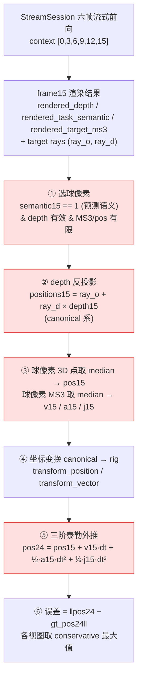

# frame24 落点：完整计算流程与误差拆解

> 目标：室内接球，最终只要 **frame24（接球面）的球 3D 落点**。
> 本文精确记录 eval 里 frame24 是**怎么从渲染结果一步步算出来**的（对应
> `scripts/eval_stream25_base.py:199 compute_rendered_frame24_position_errors`），
> 每一步的误差来源，以及 `tools/verify_physics_extrapolation.py` 如何把总误差拆开定位。

---

## 0. 一句话

模型**不直接输出球的落点**，而是：**渲染 frame15 → 预测语义选球像素 → depth 反投影成 3D 点 → median 得 pos15 → 用球区域 MS3 做三阶泰勒外推到 frame24**。整条链是"间接反算"，每一环都引入误差。

---

## 1. 完整流程图



红框 = 引入误差的环节。

---

## 2. 分步详解（对应代码）

### ① 选球像素（预测语义 mask）

```python
mask = (semantic15[eye] == 1)                       # 预测语义==球类(1)
       & torch.isfinite(depth15[eye]) & (depth15[eye] > 0)
       & torch.isfinite(ms3_15[eye]).all(dim=-1)
       & torch.isfinite(positions15[eye]).all(dim=-1)
```
`eval_stream25_base.py:214`。

- **用的是预测语义 `rendered_task_semantic`，不是 GT**（因为 frame24 是端到端产出，不能作弊看 GT）。
- 误差来源：**语义分错** → 选进非球像素 / 漏掉球像素。

### ② depth 反投影成 3D 点

```python
positions15 = ray_origins15 + ray_directions15 * depth15[..., None]   # [V,H,W,3]
```
`eval_stream25_base.py:211`。每个球像素沿相机光线、按 depth 距离投到 3D（**canonical 系**）。

- 误差来源：**depth 不准** → 3D 点在光线方向上前后偏。

### ③ median 聚合 → pos15 / v15·a15·j15

```python
pos = positions15[eye][mask].median(dim=0).values                    # 球像素 3D 点的 median
v/a/j = ms3_15[eye, ..., offset:offset+3][mask].median(dim=0).values  # offset ∈ {0,3,6}
```
`eval_stream25_base.py:224-236`。

- **median 是逐分量中位数**：把球那一坨像素压成**一个** pos15 和一组 v15/a15/j15。
- 关键性质：**median 会把逐像素噪声消掉**。所以即使逐像素 MS3 误差大（例如 `ms3_ball_acceleration` median≈0.3），聚合后的 a15 向量仍≈真实值——**逐像素指标 ≠ 这里聚合后的量**。
- 误差来源：球像素太少 / 含离群点时 median 抖动。

### ④ 坐标变换 canonical → rig

```python
pos = transform_position(pos_canonical, canonical_to_rig)
v/a/j = transform_vector(vec_canonical, canonical_to_rig)
```
MS3 与 Gaussian 在 **canonical 系**；gt_pos24 在 **rig 系**，所以先把 pos/v/a/j 旋到 rig 系再比较。位置用刚体变换、向量只用旋转部分。

### ⑤ 三阶泰勒外推到 frame24

```python
pred_pos24 = integrate_frame24_position(pos, v, a, j, dt)
# = pos + v·dt + 0.5·a·dt² + (1/6)·j·dt³
```
`stream25_metrics.py:168`。

- `dt = (target_time[24] − context_time[15]) × timespan ≈ 0.3 s`（frame15→24 共 9 帧，timespan 0.8s）。
- **物理事实**：球是标准抛物线（自由落体+初速度），真实 `a ≡ 重力 g`、`j ≡ 0`。
  - 重力贡献的位移 `0.5·g·dt² ≈ 0.5×9.81×0.3² ≈ 0.44 m` —— **主导下落量，绝不能省**。
- 误差来源：`a15/j15` 若是 free-form 噪声，被 `dt²/dt³` 放大（但见下方结论：median 后 a≈g，此项实测影响很小）。

### ⑥ conservative 聚合

```python
finite = [e for e in errors if isfinite(e)]
return max(finite)                       # 各视图里最差的那个有效误差
```
`eval_stream25_base.py:264-265`。每个视图算一个 frame24 误差，**取最大值**（最保守）。某视图球不可见→nan→跳过。

---

## 3. frame24 误差 = 三块之和

```
frame24_误差  ≈   pos15 起点误差       +   v15·dt          +   ½·a15·dt² (+ ⅙·j15·dt³)
                 (选球 + depth 反投影)     (初速度误差×dt)      (加速度项，理论上=重力)
系数：              × 1.0                  × dt≈0.3           × 0.045
```

| 误差项 | 放大系数 | 来源 |
| --- | --- | --- |
| **pos15** | **×1.0** | 选球(①) + depth 反投影(②) —— **最大权重，不衰减** |
| v15 | ×dt≈0.3 | 网络 MS3 的速度(聚合后) |
| a15 | ×0.045 | 加速度项；median 后≈重力 g |
| j15 | ×0.0045 | jerk；理论≈0 |

---

## 4. verify 脚本如何拆解（`tools/verify_physics_extrapolation.py`）

同一 ckpt、同一批提取的 pos15/v15/a15/j15，脚本输出两张表：

**表① pos15 起点误差**（frame24 的地板）：
| 球区域 | median / p95 | 含义 |
| --- | --- | --- |
| pred | … | 预测语义选球时的起点误差 |
| gt | … | GT 选球时的起点误差（只剩 depth 反投影误差） |
→ `pred − gt` 的差 = **选球错的代价**；`gt` 本身 = **depth 反投影的代价**。

**表②frame24 落点误差**（外推 × 球区域）：
| 外推 | 公式 |
| --- | --- |
| free（现状） | `pos + v·dt + 0.5a·dt² + (1/6)j·dt³` |
| phys（物理） | `pos + v·dt + 0.5·g·dt²`（a=g, j=0） |
| linear | `pos + v·dt`（对照，故意去掉重力，误差应≈0.44） |

**判读逻辑**：
- `linear ≈ 0.44` → 印证脚本正确、重力项必须有（它只是 sanity check，不是候选）。
- `pred×phys ≈ pred×free` → **外推(a/j)不是瓶颈**（median 后 a 已≈g）。
- `gt×* 比 pred×* 低很多` → **选球是瓶颈** → ball token 直接回归位置最值。
- `frame24 − pos15` 的剩余 → **v15(速度)与外推的贡献**。

---

## 5. 目前实测结论（exp004 nolseg，40 条）

| 方法 | median | p95 |
| --- | --- | --- |
| pred_free | 0.1072 | 0.2017 |
| pred_phys | 0.0998 | 0.1965 |
| linear | 0.4431 | 0.4762 |

- **linear 0.4431 ≈ 重力下落 0.44m** → 脚本与物理都对；
- **phys ≈ free（只差 ~7%）** → **a 不是瓶颈**（median 聚合后 a≈g）；
- phys 是抛物线外推的**理论上限**，却仍剩 ~0.10 → 这 0.10 **全部来自 pos15 与 v15**，不是外推公式。

→ **frame24 的病根在「球的起点 pos15（选球+depth）与初速度 v15」，不在外推、不在逐像素 a 噪声。**
下一步用 `--ball-mask-source both` + pos15 诊断，把 0.10 拆成「选球 / depth / 速度」三块，定主攻方向（大概率是 ball token 直接回归 pos15+v15，绕开选球与逐像素反投影）。

---

## 6. 关键提醒（口径陷阱）

- **别用逐像素指标推 frame24**：`ms3_ball_acceleration`、`ball_depth` 等是**逐像素 / GT 区域**统计；frame24 用**预测选球 + median 聚合 + 单点**。两套口径不可线性互推（已被误导两次）。
- **评测指标（和 GT 比的）保持 GT mask** 是正确的客观锚点；**只有 frame24 这个端到端产出用预测语义**。
